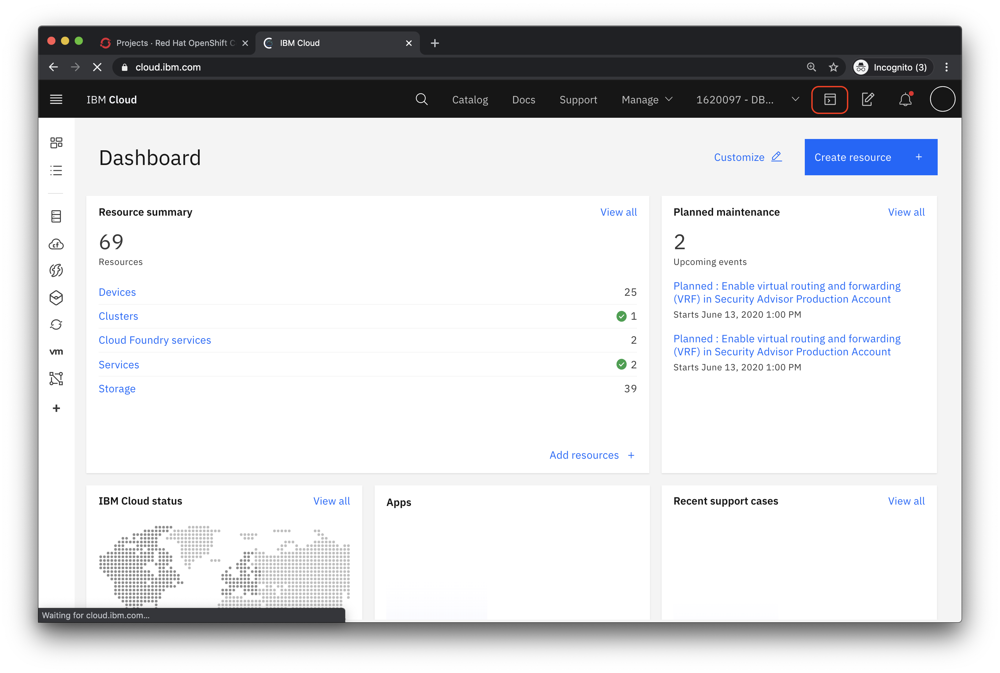
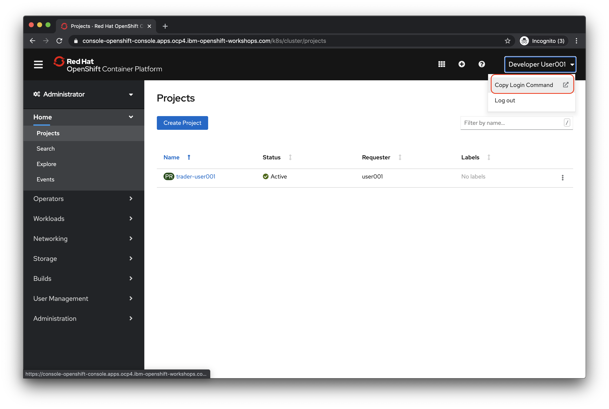
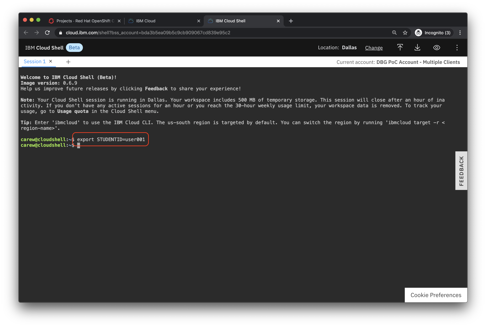

# Restarting IBM Cloud Shell

If your IBM Cloud Shell session has expired follow the instructions below to recreate your environment.


## Instructions for restarting  IBM Cloud Shell

1. Go to the IBM Cloud URL [https://cloud.ibm.com](https://cloud.ibm.com) and log in with your **ibm.com** credentials.

1.  Click the icon for  the **IBM Cloud Shell** terminal to relaunch it

      

1. In a separate browser tab go to the OpenShift console URL provided by your instructor  for the cluster designated to run the Stock Trader Lite application for the workshop.

1. Click on your username in the upper right and select **Copy Login Command**

  

1. You are prompted to login to the OpenShift console again. Repeat the same login procedure above to login.

1. Click the **Display Token** link.

1. Copy the contents of the field **Log in with this token** to the clipboard. It provides a login command with a valid token for your username.

1. In a separate browser tab go to the IBM Cloud URL [https://cloud.ibm.com](https://cloud.ibm.com) and log in with your **ibm.com** credentials.

1.  Paste the *oc login* command in  the IBM Cloud Shell terminal and run it.

1. In the IBM Cloud Shell terminal set an environment variable for the  *student id* assigned to you by the instructors (e.g. **user005**) by running the following command and replacing *user???* with your assigned *student id*.

```
export STUDENTID=user???
```
   

1. From the terminal run the following command

```
git clone https://github.com/IBMStockTraderLite/traderlite-cp4i.git
```

1. Go to the repo main directory required to run the setup scripts

```
cd traderlite-cp4i/scripts
```
